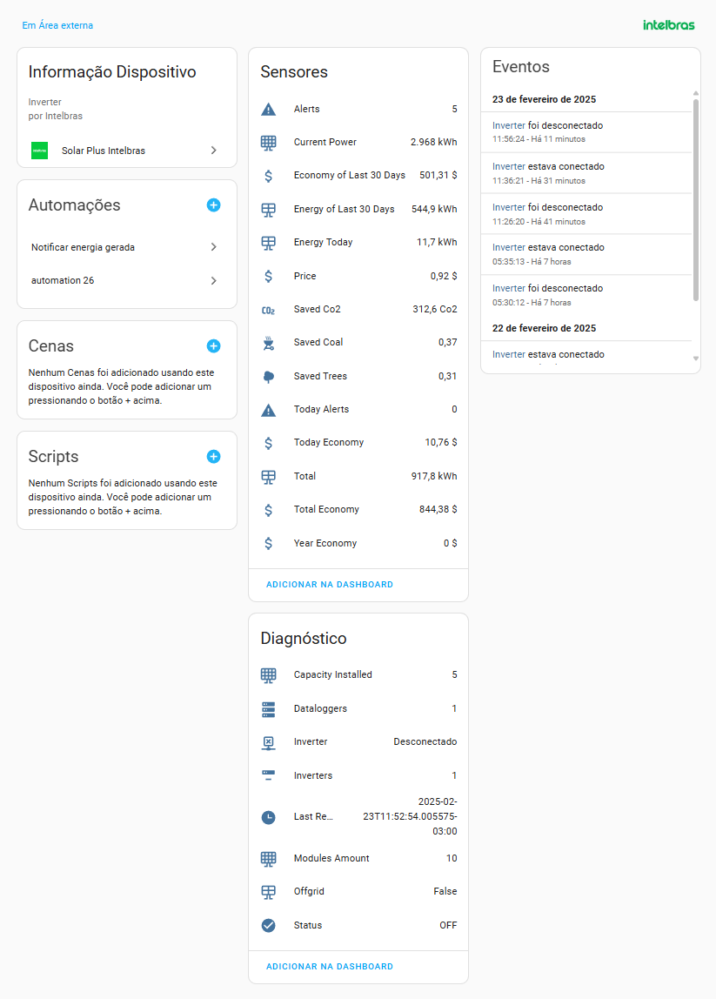
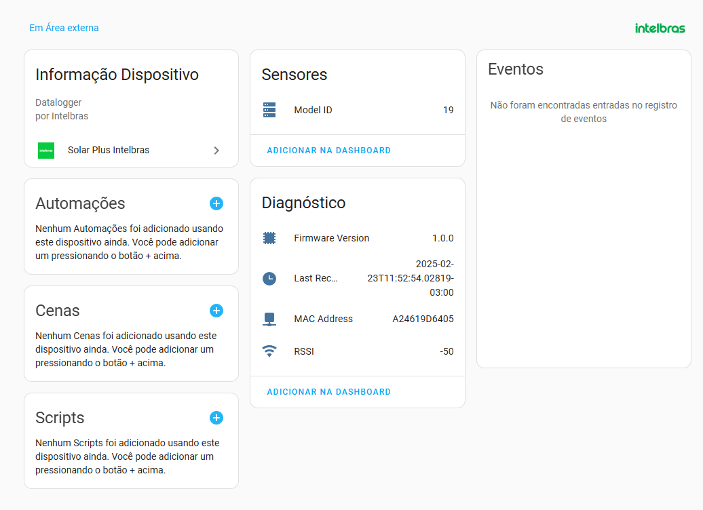

[](https://github.com/hacs/integration)
[](https://github.com/hudsonbrendon/HA-solar-plus-intelbras/actions/workflows/lint.yml)
[](https://github.com/hudsonbrendon/HA-solar-plus-intelbras/actions/workflows/validate.yml)


# Home Assistant Solar plus Intelbras


# Install

### Installation via HACS

Have HACS installed, this will allow you to update easily.

Adding Solar Plus Intelbras to HACS can be using this button:

[](https://my.home-assistant.io/redirect/hacs_repository/?owner=hudsonbrendon&repository=HA-solar-plus-intelbras&category=integration)

If the button above doesn't work, add `https://github.com/hudsonbrendon/HA-solar-plus-intelbras` as a custom repository of type Integration in HACS.

- Click Install on the `Solar Plus Intelbras` integration.
- Restart the Home Assistant.

### Manual installation

- Copy `solar_plus_intelbras`  folder from [latest release](https://github.com/hudsonbrendon/HA-solar-plus-intelbras/releases/latest) to your `<config dir>/custom_components/` directory.
- Restart the Home Assistant.

## Configuration

Adding Drivvo to your Home Assistant instance can be done via the UI using this button:

[](https://my.home-assistant.io/redirect/config_flow_start?domain=solar_plus_intelbras)

### Manual Configuration

If the button above doesn't work, you can also perform the following steps manually:

* Navigate to your Home Assistant instance.
* In the sidebar, click Settings.
* From the Setup menu, select: Devices & Services.
* In the lower right corner, click the Add integration button.
* In the list, search and select `Solar Plus Intelbras`.
* Follow the on-screen instructions to complete the setup.

## Authentication

To authenticate, use the same email used at [https://solarplus.intelbras.com.br/](https://solarplus.intelbras.com.br/) and the token named "plus," which can be captured in any request in your browser’s network tab, for example:


- 1 - your plant_id;
- 2 - your token "plus".

## Usage

Add inversors via Integrations (search for `Solar Plus Intelbras`) in Home Assistant UI. You can also simply click the button below if you have MyHomeAssistant redirects set up.

[](https://my.home-assistant.io/redirect/config_flow_start/?domain=solar_plus_intelbras)

## Devices

This custom component creates the following devices:

### Inverter



### Datalogger



# Debugging

To enable debug for Drivvo integration, add following to your configuration.yaml:

```yml
logger:
  default: info
  logs:
    custom_components.solar_plus_intelbras: debug
```

# Disclaimer

Intelbras does not provide an official API, the information comes from the API used in the official system used by the web and mobile platform, the integration is based on the library [https://github.com/hudsonbrendon/python-solar-plus-intelbras](https://github.com/hudsonbrendon/python-solar-plus-intelbras) and there may be unavailability and blocking of the API.
